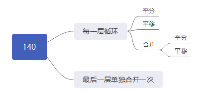

<h1>天平称盐程序设计</h1>

# 1. 项目简介
**项目：**
><font face="楷体">**天平称盐程序设计——称盐步骤模拟器。**</font>

**项目描述：**
> <font face="楷体">
> 使用Python求解题目：<br>  
> <b><font color="pick">有2克、7克砝码各一个,天平一架,如何利用天平和砝码称三次,将140克盐分成90克、59克各一份？有哪些方法？</font></b><br>
>（注：只需要关注使用天平的次数，而非总体操作步数，比如沙堆之间的合并操作未用到天平，不算入使用的天平次数）<br><br>
>
> 主程序：[chenyanV3.py](/chenyanV3.py)  
> 计算结果： [文本&图片描述,点击跳转](#jump)
> </font>


**当前版本：**
> <font face="楷体">V3 [(历史版本V1, V2)](./README_history.md)</font>


**设计框架：**  
> <font face="楷体">实例中，  
> 1）通过对问题的最基本认识，总结出，可以完成所有操作的最基本方法：平分、平移、合并；分析每一个分步骤可建立单独计算的单元函数。  
> 2）随后设计能存储每一种结果的数据结构，可通过完成计算形成一颗庞大的树；去除重复结果，总计 33693 种方法。  
> 3）使用递归函数取出树结构的每一支，判断最终结果是否是符合我们要求。  
> 最终，筛选出 23 种绝对无重复的方法。</font>  


# 2. 问题分析 及 程序设计逻辑

## 2.1. 设计存储所有结果的数据存储结构
在模拟计算之前，我们需要设计一个能存储所有结果的数据结构。这里我们采用树结构存储每一种可能的结果，其中字典的键存储当前使用天平的所有可能结果，值为这一步骤后的下一次执行结果（又是相同结构的字典）。

数据存储的逻辑结构：

    # 当前沙堆 , 分出沙堆 , 平移 , 平分 , 合并 , 天平使用次数
    D = {(140, (), (fa), (fa), (fa), 0): {...}}

        fa = ((a1,-a2), ((b1,b2),+a2))
            a1 -- 左砝码
            a2 -- 左边用沙堆当做的砝码
            b1 -- 右砝码
            b2 -- 右边用沙堆当做的砝码

## 2.2. 三个基本操作方法定义
通过简单分析，在称盐的过程中一共可以分解为三种基本操作：平分、平移、合并。其中，用到天平的操作只有平分和平移。

**平分：**  
从待操作沙堆中将所有沙子全部放入天平两侧；  
通过天平在两侧的分配，控制不同分法。  

**平移：**  
从待操作沙堆中将部分沙子放入天平两侧；  
通过天平在某一侧的分配，控制不同分法。  
（这里有一个特殊情况，之前分出的沙堆，可以和砝码放在天平一侧一起作为“砝码”）

**合并：**  
将刚分出的沙堆与之前已经分出来的沙堆进行合并  
（这里有一个限制条件：刚分出来的两堆沙堆不能进行合并）

程序设计思想：平分、平移、合并三个基本操作设计对应单独的计算模块函数）
```python
class chenyan(object):
	def __init__(self, IN=140, TAR=50, FAMA=(2, 7), STEP=3):
		...
	def __pingyi__(self, shadui_infos):
		...
	def __pingfen__(self, shadui_infos):
		...
	def __hebing__(self, shadui_infos):
		...
```


## 2.3. 中间计算逻辑

需求：每一层计算都需要将天平的使用次数推至下一次，目的是为了让末枝记录的天平已使用次数保持一致。
<font face="楷体">
> 1. 为了保证计算逻辑的统一，实际操作中需要将合并的那一次操作结果，进行下一次能推动天平使用的计算（平移、平分）。程序实际设计中，为了保证信息不遗失，下一次合并计算的第一个值只需要复制当前合并结果。
> 2. 此逻辑无法处理最后一次操作（即天平使用次数用完后）之后的合并操作，因此，当最后一次计算完毕，需要单独再在树枝末进行单独处理一次合并。
</font>

这里定义计算的结构：



<!-- 
	1. 每一层循环
		1. 平分
		2. 平移
		3. 合并
			1. 平分
			2. 平移
	2. 最后一层单独合并一次
-->

对应程序设计：
```python
class chenyan(object):
	...
    def __compte_next__(self, D_result):
        """通过此层字典计算下一层字典
                沙堆 可合并 天平
        in : {((140), (), (), (), 1): {}}
        out: {((140), (), (), (), 1): {
                ((70), (70), (), (), 1): {},
                ((69), (71), (), (), 1): {},
                ((71), (69), (), (), 1): {},
            }
        """
        for shadui_infos in D_result:
            # 处理平移
            D_result[shadui_infos].update(self.__pingyi__(shadui_infos))
            # 处理平分
            D_result[shadui_infos].update(self.__pingfen__(shadui_infos))
            # 合并之后进行平移、平分，使得当前分支最底层步数保持一致
            hebing_result = self.__hebing__(shadui_infos)
            D_result[shadui_infos].update(hebing_result)
            if hebing_result:
                for hebing_info in hebing_result:
                    D_doing = D_result[shadui_infos][hebing_info]
                    # 处理平移
                    D_doing.update(self.__pingyi__(hebing_info))
                    # 处理平分
                    D_doing.update(self.__pingfen__(hebing_info))
        return D_result
```

## 2.4. 对计算结果的枝末递归遍历取出所有
使用递归算法，重复进行遍历操作。

```python
class chenyan(object):
	...
    def __get_values__(self, D):
        """返回字典每一个分支的最后一个元素的列表"""
        L = []
        for key in D:
            if not D[key]:
                L.append({key: D[key]})
            else:
                L.extend(self.__get_values__(D[key]))  # 利用递归求最后一个元素
        return L
```

## 2.5. 对结果进行递归遍历
对于树结构的字典，如何展开为一个列表呢？

```python
"""
遍历输出嵌套字典

假如存在字典：
D = {
    1: {21: {28: {},
             29: {},
             30: {300: {301: {302: {}}}},
             32: {300: {}}},
        22: {33: {}}}, }

字典关系：
1   21  28
        29
        30  300 301 302
        32  300
    22  33

需要输出以下结果，如何实现呢？
结果：
1   21  28
1   21  29
1   21  30  300 301 302
1   21  32  300
1   22  33
"""
```

为减少资源消耗，递归生成结果中采用生成器。  
详细代码见：[pkg_expand_dict.py](/pkg_expand_dict.py)

## 2.6. 从所有结果中筛选无重复的方法探索

程序设计一开始的阶段，我们从逻辑结构已经定义了两条规则。
> <font face="楷体">1) 设计<b>主操作沙堆</b>始终在第一堆。  
> 2) 平分和平移的操作一定会让<b>主操作沙堆</b>减少。  
> 3) 最后筛选结果是从<b>主操作沙堆</b>来筛选的。</font>


<h4>思考1：能否只以结果为50作为筛选条件？</h4>

由于前两条的限制，使得如果只采用以50为判断依据，会让以下2种方法遗失，最终结果就只有21种方法。


因为第二条原则，不会让主操作沙堆9进行累加`9-->16-->50`，中间可用9+16得到的25g沙堆直接当做砝码称出另一堆25g，两堆合并即可得到50g。但从本质上说，这个方法和图中的method4简直一模一样，只是从局部看的角度不同。

<h4>思考2：能否直接以结果为50和90作为筛选条件？</h4>

这是按照都考虑50和90这一原则筛选出来的34种结果：  
﹣ 流程文字：[Result2.txt](/Result2.txt)  
﹣ 流程图片：[result.gv2.png](/result.gv2.png)

考虑50和90为最终筛选的结果，结果发现让很多方法出现重复。  

经统计，公出现11组重复的方法。因为终止条件不同，让筛选出现两次，因此可以只取一次。
```
9  vs 10
11 vs 12
14 vs 15
16 vs 17
18 vs 19
20 vs 21
22 vs 23
27 vs 28
29 vs 30
31 vs 32
33 vs 34
```
示例：
- 方法9和方法10
	```
	方法9：
	-> 第1步, 平分, 【140】-->【  70 +  70 】, 天平【左: +0g砝码-70g沙堆, 右: +0g砝码-70g沙堆】
	-> 第2步, 平分, 【 70】-->【  35 +  35 】, 天平【左: +0g砝码-35g沙堆, 右: +0g砝码-35g沙堆】
	-> 第3步, 平分, 【 35】-->【  20 +  15 】, 天平【左: -2g砝码-20g沙堆, 右: -7g砝码-15g沙堆】
	-* 合并：沙堆【20, 70】合并为【90】

	方法10：
	-> 第1步, 平分, 【140】-->【  70 +  70 】, 天平【左: +0g砝码-70g沙堆, 右: +0g砝码-70g沙堆】
	-> 第2步, 平分, 【 70】-->【  35 +  35 】, 天平【左: +0g砝码-35g沙堆, 右: +0g砝码-35g沙堆】
	-> 第3步, 平分, 【 35】-->【  15 +  20 】, 天平【左: -7g砝码-15g沙堆, 右: -2g砝码-20g沙堆】
	-* 合并：沙堆【15, 35】合并为【50】
	```
	  
	  

- 方法11和方法12：
	```
	方法11：
	-> 第1步, 平分, 【140】-->【  70 +  70 】, 天平【左: +0g砝码-70g沙堆, 右: +0g砝码-70g沙堆】
	-> 第2步, 平分, 【 70】-->【  35 +  35 】, 天平【左: +0g砝码-35g沙堆, 右: +0g砝码-35g沙堆】
	-* 合并：沙堆【35, 70】合并为【105】
	-> 第3步, 平分, 【105】-->【  55 +  50 】, 天平【左: -2g砝码-55g沙堆, 右: -7g砝码-50g沙堆】
	-* 合并：沙堆【55, 35】合并为【90】

	方法12：
	-> 第1步, 平分, 【140】-->【  70 +  70 】, 天平【左: +0g砝码-70g沙堆, 右: +0g砝码-70g沙堆】
	-> 第2步, 平分, 【 70】-->【  35 +  35 】, 天平【左: +0g砝码-35g沙堆, 右: +0g砝码-35g沙堆】
	-* 合并：沙堆【35, 70】合并为【105】
	-> 第3步, 平分, 【105】-->【  50 +  55 】, 天平【左: -7g砝码-50g沙堆, 右: -2g砝码-55g沙堆】
	```
	  
	  


而减去这11种重复，由`34-11=23`恰好为我们最终想要的结果。


<h4>思考3：如何设计一个同时满足上述需求的原则？</h4>

从上述思考中，我们发现了一个两难的问题，信息遗失和信息重复，<font color="red"><b>那么如何才能避免出现合并为90的这种重复呢？</b></font>

我们重新设计筛选的原则：
> 第一，结果仅为50(防止90的镜像重复方法)；  
> 第二，结果可为90，但必须存在平移操作(当存在平移时不可能镜像重复)

在代码中，我这样呈现（200-202行）：
```python
if (LL[-1][0] == self.TAR) or (
		LL[-1][0] == self.IN - self.TAR
		and [STEP for STEP in LL if STEP[2]]):
```

当然，还有第二种方法，将所有的方法计算完毕进行方法内部的统一排序，通过一定原则排序得到的方法一定是唯一而无重复的，也能达到去重效果。

<span id="jump"></span>
# 3. 运行结果

计算结果可视化的代码：[pkg_view.py](/pkg_view.py)

结果：
- 文本描述可视化：  
[Result.txt](/Result.txt)

- 图片描述可视化：  
  ( PS：括号左，所需砝码；括号右，移动操作的沙堆 )


