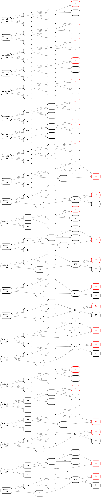

## 天平称盐程序设计

> 
> <b>
> 有一天平, 2克和7克砝码各一个。若想利用天平和砝码来将140克盐分成50克和90克两份, 规定只能使用3次天平进行称量，有哪些方法？
> </b> 
>（PS：只需要关注使用天平的次数，而非总体操作步数，比如沙堆合并操作，不算使用天平）
>

 

当前版本：V3 [(历史版本V1, V2)](./README_history.md)

可视化运行结果：  
（PS：括号左，所需砝码；括号右，移动操作的沙堆）

