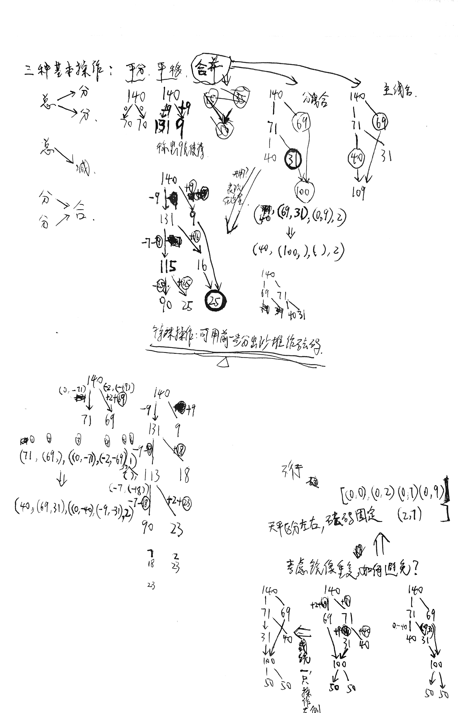
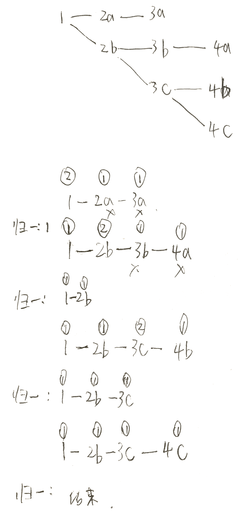

# 1. 设计思考的原始笔记

## 1.1. 三种基本操作函数设计



## 1.2. 字典展开的逻辑设计
原版笔记：  


## 1.3. 砝码定义的设计思路

- 关于左右砝码的区分与否问题设计？  
  - 不交换，逻辑结构不好设计，因为从分量里面去进行下一步操作  
  - 但交换会造成镜像重复。交换的方式可以从砝码层面的交换去解决	


- 镜像重复的真正原因是什么？  
  - 问题的解决，统一只操作左侧能否完美搞定呢？	
	

- 结构设计  
   - [ ] ~~平移的递增方式。舍弃~~
   - [ ] ~~分支调整~~
   - [ ] .


Tables:

```python
((a1,a2),(b1,b2))

a1 -- 左砝码
a2 -- 左边用沙堆当做的砝码
b1 -- 右砝码
b2 -- 右边用沙堆当做的砝码
```

| 当前沙堆 | 分出沙堆 |      平移       |        平分        | 合并 |
| -------- | -------- | --------------- | ------------------ | ---- |
| 140      | ()       | ()              | ()                 | ()   |
| 131      | (9,)     | ((-9,0),(+9,0)) | ()                 | ()   |
| 61       | (9,70)   | ()              | ((-9,-61),(0,-70)) | ()   |
| 50       | (9,70)   | ()              | ((-9,-61),(0,-70)) | ()   |

| 当前沙堆 | 分出沙堆  |       平移        |        平分        | 合并 |
| -------- | --------- | ----------------- | ------------------ | ---- |
| 140      | ()        | ()                | ()                 | ()   |
| 69       | (71,)     | ()                | ((-2,-61),(0,-71)) | ()   |
| 62       | (71,7)    | ((-7,0),(+7,0))   | ()                 | ()   |
| 50       | (71,7,12) | ((-9,-7),(0,+12)) | ()                 | ()   |

| 当前沙堆 | 分出沙堆  |        平移        | 平分 | 合并 |
| -------- | --------- | ------------------ | ---- | ---- |
| 140      | ()        | ()                 | ()   | ()   |
| 131      | (9,)      | ((-9,0), (+9,0))   | ()   | ()   |
| 115      | (9,16)    | ((-7,-9),(0,+16))  | ()   | ()   |
| 90       | (9,16,25) | ((-9,-16),(0,+25)) | ()   | ()   |

| 当前沙堆 | 分出沙堆  |        平移         | 平分 | 合并 |
| -------- | --------- | ------------------- | ---- | ---- |
| 140      | ()        | ()                  | ()   | ()   |
| 131      | (9,)      | ((-9,0), (+9,0))    | ()   | ()   |
| 113      | (9,16)    | ((-9,-9),(0,+18))   | ()   | ()   |
| 90       | (9,16,25) | ((-7,-18),(+2,+23)) | ()   | ()   |

# 2. 结果分析
1. 称盐过程中未出现小数。  
关于第二条的证明：
假设出现小数，倒推回去。
若出现小数，至少需要使用天平几次？或者这个证明本身错误。
过程中绝对不可能出现小数。
9
71    60
35.5  14.5
50
